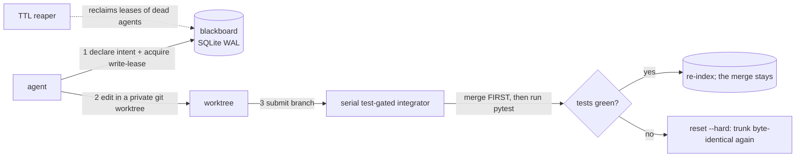

# swarm-sync

**Stigmergy for AI coding swarms.** A shared, live memory that lets many AI coding agents edit the
*same* codebase at once without colliding.

> Multiple AI agents on one repo collide — same files, merge conflicts, broken assumptions, duplicated
> work. swarm-sync analyzes and classifies the codebase into safely-parallel **parcels**, hands each
> agent an exclusive **lease** and its own **git worktree**, and keeps everyone in sync through a shared
> **blackboard** — a live SQLite representation of the current state of the code. Coordination is
> *stigmergic*: agents read and write the environment, never each other.

This is the **Pheromesh** architecture (the name is explained below).

---

## How this was built

swarm-sync was built in five days by a swarm of Claude Code agents, coordinated by an earlier
version of swarm-sync itself. I did not hand-write the 22,000 lines, and the commit trailers say so.

What I did is the part that decides whether generated code is trustworthy: the design spec, six
rounds of adversarial audit, the phased improvement plan, and the two rules the campaign ran under —
*a fix without a test that fails when you delete the fix is not a fix*, and *roughly half of
unverified findings die on contact, so reproduce before you fix and report the non-repro instead*.

The receipts are in the repo. [`docs/AUDIT.md`](docs/AUDIT.md) is the review that found the P0 in
crash-recovery reconciliation. [`docs/IMPROVEMENT_PLAN.md`](docs/IMPROVEMENT_PLAN.md) is how it got
scheduled and closed. [`docs/SYMBOL_MODE_DESIGN.md`](docs/SYMBOL_MODE_DESIGN.md) is a feature I
designed, measured, and decided not to build.

---

## Status

A working prototype and a local developer tool — not a hosted service. The engineering is
deliberately thorough: **605 tests** (run 3× with zero flakes), `ruff` + `mypy` clean, and five
review-gated hardening phases — correctness, resource bounds, architecture consolidation, and an
operator surface (`swarmsync status`/`holds`/`free`/`doctor`). Every fix carries a test that fails
when the fix is removed, and the architecture pass was adversarially reviewed before it merged.

Separately, **38 scale tests** under [`tests/scale/`](tests/scale/) drive the broker against a real
34-module, 10k-line repository with its own 252-test suite, rather than the 96-line `sample_repo` the
demo uses. They are excluded from the count above because they are slow (~58 s: they clone a repo,
index 567 parcels, and run real pytest gates) and because they are honest about what that costs — in
one of three full-suite runs with them included, `test_demo.py` timed out under the added contention.
One flake in three runs is not "zero flakes," so it is reported here rather than averaged away. Run
them with `pytest tests/scale/`; what they found is in the note under *How it works*.

Scope is intentionally tight: Python target (the classifier is stdlib `ast`; a tree-sitter backend
is a documented extension point), deterministic scripted agents in the demo (a real Claude Agent SDK
worker is a drop-in for the mutator), a serial integrator, and no TUI. The one designed-but-parked
capability — per-symbol locking — is documented with its revival plan in
[`docs/SYMBOL_MODE_DESIGN.md`](docs/SYMBOL_MODE_DESIGN.md).

---

## Documentation

- **Use it** → this README.
- **Understand or improve it** → [`ARCHITECTURE.md`](ARCHITECTURE.md) — how the pieces work, in plain language, and where each lives in the code.
- **The full build spec** → [`docs/DESIGN.md`](docs/DESIGN.md) — schema, every endpoint, the failure table, the operational contract.
- **Every knob** → [`docs/CONFIGURATION.md`](docs/CONFIGURATION.md) — env vars, launcher and CLI flags, the raw hook block.
- **The adversarial review** → [`docs/AUDIT.md`](docs/AUDIT.md), scheduled and closed by [`docs/IMPROVEMENT_PLAN.md`](docs/IMPROVEMENT_PLAN.md).
- **The feature that wasn't built** → [`docs/SYMBOL_MODE_DESIGN.md`](docs/SYMBOL_MODE_DESIGN.md) — why per-symbol leasing is parked, and its staged revival plan.

---

## The words this README uses

swarm-sync borrows its vocabulary from ant colonies and databases. Read these once and the rest of
the README (and the code) reads easily:

- **Stigmergy** — coordination by leaving marks in a shared environment instead of messaging each
  other. Ants drop pheromone trails and follow trails; they never hold meetings. swarm-sync's agents
  work the same way: they only ever read and write the shared blackboard, never talk directly.
- **Pheromesh** — the name for this whole architecture: *pheromone* + *mesh*. A mesh of agents
  coordinating through one shared, decaying, stigmergic memory. It's the design this repo implements,
  not a library you install.
- **Blackboard** — that shared memory: a single SQLite database every agent reads and writes. It
  holds the parcel map, the leases, the frozen contracts, the pheromone trails, and an append-only
  event log.
- **Parcel** — a leasable unit of code. The classifier parses the repo into one parcel per
  function/method/class, plus one synthetic parcel for each whole file. (Today the lock is always
  taken on the whole-file parcel — see [Granularity](#granularity-swarm-sync-locks-whole-files).)
- **Lease** — a temporary, exclusive claim on a file. Holding it means you're the only agent allowed
  to edit that file right now. It expires unless refreshed, so a crashed agent can't lock a file
  forever.
- **Worktree** — a private git checkout. Each broker-driven agent gets its own, so two agents can't
  even physically write the same file on disk.
- **Contract** — a heavily-depended-on function signature, "frozen" because so much breaks if it
  changes. When one changes, dependents get a `contract_change` notice so they can re-plan.
- **Pheromone trail** — the decaying "I'm planning/working here" signals in the event log, so agents
  can see current activity without messaging each other.
- **Integrator** — the single gatekeeper that merges each agent's branch one at a time, runs the
  tests, and **rolls the merge back if they fail** — so the main branch is never broken.
- **Reaper** — the background janitor that clears the leases of agents that died (stopped
  heartbeating) and lets their work be reassigned.

For how these fit together and where they live in the code, see [`ARCHITECTURE.md`](ARCHITECTURE.md).

---

## Two ways to use it

Pick the one that matches how your agents run — the setup is different:

1. **Claude Code hooks (recommended for real use).** You run Claude Code agents/subagents normally;
   swarm-sync's hooks gate every edit *transparently* in the background. No wiring agents by hand.
   → [Jump to the Claude Code setup](#use-with-claude-code).
2. **The scripted broker/demo.** A Python harness (`coordinator/broker.py`) drives agents directly
   against the blackboard. This is what the demo and test suite use, and how you'd embed swarm-sync
   in your own orchestrator. → Start with **Try it in 2 minutes** below.

Either way, **the unit of the lock is a whole file**: two agents never edit the same file at once —
the second waits. Parallelism comes from working on *different* files. (More in
[Granularity](#granularity-swarm-sync-locks-whole-files).)

---

## Try it in 2 minutes

**Requires Python 3.11+**, and the preflight below enforces it as a command rather than a comment.
Skip it and, on Python 3.10 or older, `pip install` never mentions the version: it disappears into
resolver backtracking, downloads 100+ `ruff` wheels, prints nothing for ~8 minutes, and then fails.
`requires-python` does not gate the `pip install -e` path, so prose cannot do this job.

```bash
git clone https://github.com/keithalindsay/swarm-sync.git
cd swarm-sync
```

```bash
# Preflight + venv in one step: on 3.10 this fails in a second with a real message.
python3.11 -m venv .venv || { echo "swarm-sync needs Python 3.11+; found $(python3 -V 2>&1)"; exit 1; }
source .venv/bin/activate

# --only-binary=:all: refuses source distributions outright, so pip cannot vanish
# into backtracking — a missing wheel becomes an immediate, legible error instead.
pip install --only-binary=:all: -e ".[dev]"

python demo/run_demo.py      # the whole thing, standalone
```

(Inside the venv, `python` exists and is your 3.11+ — most distros ship no bare `python` outside one.
Any newer interpreter works: substitute `python3.12`/`python3.13` for `python3.11` above.)

The demo boots a blackboard, indexes a sample repo, and runs a 3-agent swarm through five scenarios.
You should see:

```
RESULTS
  PASS: test case #1 (three agents on three files land concurrently, clean)
  PASS: test case #2 (contended whole-file parcel serializes)
  PASS: test case #3 (frozen-contract change notifies + dependent re-plans)
  PASS: test case #4 (crash mid-edit is recovered)
  PASS: test case #5 (serial gated integration rejects a bad edit)
  PASS: overall (zero collisions, trunk green throughout)
```

That's the product in one command: three agents editing three different files land cleanly and
concurrently; a fourth hitting a file someone already holds waits its turn; a signature change is
detected and its dependents re-plan; a crashed agent's work is reclaimed; and a test-breaking edit
is rejected before it can reach trunk.

Run the test suite the same way:

```bash
pytest
```

---

## How it works (one paragraph)

A **classifier** parses the repo (Python via the stdlib `ast` module) into *parcels* — one per
function, method, and class, plus a synthetic per-file parcel for the glue — computes each parcel's
**blast radius** (how much breaks if it changes), and freezes high-fan-in **interface contracts**.
A **blackboard** (SQLite in WAL mode) holds the parcel map, leases, contracts, decaying **pheromone**
trails, and an append-only event log. Each agent declares intent, acquires an **atomic write-lease**
on a file, edits inside its **own git worktree**, heartbeats, then submits its branch to a **serial,
test-gated integrator** that merges, runs `pytest`, and re-indexes — rolling the merge back if the
tests go red, so a break never *survives* on trunk. A **TTL reaper** reclaims the leases of agents
that crash.

> **Read that ordering literally: the merge lands, then the gate runs.** For the duration of the
> pytest run, trunk's HEAD — and trunk's checkout on disk — carry the unverified merge; a red verdict
> then `reset --hard`s it away, leaving trunk byte-identical and the bad commit reachable only from
> the reflog, never as an ancestor. Measured on a 34-module repo the window was **14–20 s**, bounded
> above only by `SWARMSYNC_GATE_TIMEOUT` (default 600 s). This is why
> `reconcile_orphaned_integrations` exists: the window can outlive a crash.
>
> An earlier version of this sentence said "so trunk is never poisoned." That was false, and the
> falsification is pinned by a test
> ([`tests/scale/test_trunk_integrity.py`](tests/scale/test_trunk_integrity.py)) that asserts the
> measured reality and will fail if anyone ever moves the gate ahead of the merge — which is the
> correct signal to rewrite this paragraph. The guarantees table below was always accurate.



For the expanded, plain-language version — how each piece works, the life of one edit end to end, and
a map from every concept to the code that implements it — see [`ARCHITECTURE.md`](ARCHITECTURE.md).

---

## Use with Claude Code

Instead of wiring agents in by hand, let Claude Code's own hooks enforce leasing **transparently**:
every `Edit`/`Write` a (sub)agent makes is gated by a real-time lease check, and its lease is
released automatically when the agent stops. When two agents reach for the same file, the second is
denied with a message like:

```
swarm-sync: payments.py is leased by agent-a (~280s left on the current hold; the hold renews while its holder stays active). Pick different work -- run `swarmsync holds` to see who holds what (or GET http://127.0.0.1:8787/leases).
```

> A Claude Code **skill** ships in this repo at [`.claude/skills/swarmsync/`](.claude/skills/swarmsync/SKILL.md):
> it teaches an agent the lease protocol, how to respond to a deny, and the `swarmsync` CLI. Copy it
> into your own `~/.claude/skills/` (or a project's `.claude/skills/`) so agents pick it up automatically.

### Setup

**1 — Wire the hooks.** From your repo root, run `swarmsync init-hooks`. It writes the hook block
(idempotently) into `<cwd>/.claude/settings.json` — or `~/.claude/settings.json` with `--global`, and
`--dry-run` previews without touching anything — and drops the `.swarmsync-active` marker at the
repo's git toplevel to turn coordination on. Run it from the repo root so the two land together.

```bash
swarmsync init-hooks --dry-run     # see exactly what it would write
swarmsync init-hooks               # do it
```

The block wires `scripts/swarmsync-hook-guard`, **not** `swarmsync-hook` directly. The guard is a
zero-overhead shim: when swarm-sync isn't active for a repo (step 3) it exits `0` immediately without
even starting Python, so normal, non-coordinated editing pays nothing. It only launches the real
adapter when a session is active. The literal JSON, for anyone who prefers to paste it by hand, is in
[`docs/CONFIGURATION.md`](docs/CONFIGURATION.md#the-claude-code-hook-block).

**2 — Start the blackboard server**, pointed at the repo you're coordinating:

```bash
swarmsync-serve --root /path/to/your/repo --db /tmp/swarmsync.db --port 8787
```

Leave it running for the session — it's the shared blackboard every hook call and agent talks to. It
prints the repo it's managing at startup; **check that line matches the repo you mean to coordinate**
(this is the single most common misconfiguration — see [Troubleshooting](#troubleshooting)).

**3 — Turn coordination on for the repo.** Enforcement is opt-in per repo:

```bash
touch /path/to/your/repo/.swarmsync-active     # on
rm    /path/to/your/repo/.swarmsync-active     # off
```

(Or set `SWARMSYNC_ACTIVE=1` in the environment — handy for CI. When neither is set, the hooks are a
no-op and every edit is allowed, so installing the hooks never interferes with ordinary work.)

**4 — Confirm, then run your agents.** `swarmsync doctor` checks the whole setup end to end (server
reachable, root matches the cwd's git toplevel, marker present and fresh, hooks wired, DB writable,
version match, and that the gate's interpreter can actually collect this repo's tests — see
`SWARMSYNC_GATE_PYTHON`) and prints a remedy for each check that fails. Then that's it: edits to free files
proceed silently; edits to a file another agent holds are denied with the message above until it's
released.

### Operating a session — the `swarmsync` CLI

A single read-only command talks to the running blackboard over the same HTTP the hooks use (default
`$SWARMSYNC_URL`), so you — or a denied agent, from its own shell — can see and steer coordination:

```bash
swarmsync status              # is the server up, bound to which repo, how busy?
swarmsync holds               # every active hold: parcel, holder, mode, TTL-remaining
swarmsync free payments.py    # of these paths, which are free? (exit 1 if any held)
swarmsync events --follow     # tail the event stream
swarmsync doctor              # diagnose the setup; each check prints a fix if it fails
```

`swarmsync free foo.py && …` gates work in one line — the deny message an agent hits points it right
back here (`swarmsync holds`). Two global flags come before the subcommand: `--url` (default
`$SWARMSYNC_URL`) and `--timeout` (default 8s); `events` also takes `-n N` for how many to show.

For the raw API, the server serves interactive Swagger docs at `GET http://127.0.0.1:8787/docs`, and
`GET /health` is the single unauthenticated read that `status` and `doctor` are both built on — it
returns `{version, root, db_path, active_leases, last_event_seq}`, which is everything you need to
answer "is it up, and which repo is it bound to?" in one request. Full flag reference:
[`docs/CONFIGURATION.md`](docs/CONFIGURATION.md).

### Troubleshooting

Two failure modes are quiet by design (the hooks *fail open* so they never block ordinary work), so
they're worth knowing before they bite:

- **The server's managed root must contain your repo.** `swarmsync-serve` restricts `/index` and
  `/integrate` to paths under its root (`--root`, or `SWARMSYNC_ROOTS`, defaulting to the launch
  directory). If it's pointed anywhere that isn't an ancestor of your repo, indexing is refused,
  nothing gets a parcel, and — because the hooks fail open — **every edit is allowed with no
  coordination at all**, silently. The fix is always: pass `--root` explicitly and confirm the
  startup line. One server coordinates **one** repo; for a second repo, run a second server on
  another port.
- **Your session does not have to run inside the repo it edits.** Coordination keys on the
  repo containing the **file being edited**, not on the session's `cwd`, so running Claude
  Code from a workspace root, a parent directory, or another project still coordinates
  edits into a marked repo. This was not always true: keying on `cwd` meant a subagent —
  which inherits its parent session's `cwd` — silently bypassed the fabric entirely
  whenever that `cwd` sat outside the repo. Found by dogfooding, with three concurrent
  agents editing a coordinated repo while the blackboard recorded **0 leases and 0
  events**, `swarmsync doctor` reported all eight checks green, and stderr stayed empty.
  Fixed and pinned by regression tests; noted here because "does my session have to be
  *in* the repo?" is a fair question and the answer is now no.
- **The hook talks to port 8787 by default.** The adapter's default `SWARMSYNC_URL` is
  `http://127.0.0.1:8787`, matching the launcher's default port — so a stock `swarmsync-serve` and a
  stock hook find each other with no configuration. If you serve on a different `--port` (or host),
  export `SWARMSYNC_URL` to match, or the hook can't reach the server and (failing open) allows
  every edit.

There is exactly **one launcher**: `swarmsync-serve` (the `swarm-sync` command is the same program —
both console scripts run the same `main`). Same defaults everywhere: port **8787**, DB
`swarmsync.db` (or `SWARMSYNC_DB`), `--root`/`--fresh`, the managed-root banner, and the startup
clock check. Earlier versions shipped a second launcher on port 8000 with different defaults;
following the wrong one was a silent fail-open, so it's gone.

## Configuration

Every knob is optional and every default is sane, so nothing here is required to run swarm-sync. The
full reference — all thirteen `SWARMSYNC_*` environment variables, `swarmsync-serve`'s flags, the
`swarmsync` CLI's flags, and the raw Claude Code hook block — is in
[`docs/CONFIGURATION.md`](docs/CONFIGURATION.md). Two properties hold across all of it: a garbage
value falls back to the default rather than crashing (a typo must never take the blackboard down or
silently disable a lease), and every read goes through
[`swarmsync/config.py`](swarmsync/config.py), the one module allowed to touch the environment.

---

## What swarm-sync guarantees

| Layer | Mechanism | What it gives you |
|---|---|---|
| Physical | git worktree per agent | same-file clobbering is structurally impossible — for **broker-driven** agents. (Hook-driven Claude subagents share one working tree, so there the lease below is the only protection.) |
| Logical | atomic SQLite CAS lease, **one whole file per lock** | one writer per file, on both the broker and hook paths; the loser of a race is denied and waits. Covers `Edit`/`Write`-family tools — a raw `Bash` write (`sed -i`, `cat >`) bypasses it (see [Security](#security-and-trust-model-read-before-exposing-this-to-anything)). |
| Interface | frozen contracts + `contract_change` events | a landed signature change is **detected and announced** to its dependents so they re-plan. Detection is what ships; it does not *prevent* an in-flight dependent from having built against the old signature (DESIGN §5.3). |
| Integration | serial pytest-gated merge | trunk stays green: every branch is merged, tested, and **rolled back if red**. A break is caught before it *survives* on trunk. Semantic conflicts no test covers are the honest hard limit (DESIGN §6). |

### Granularity: swarm-sync locks whole files

**The unit of parallelism is the file.** Every lease the broker and the Claude Code hook take is on
the one synthetic per-file parcel (`<relpath>::<module>`), regardless of how finely the classifier
parsed the file. So two agents never edit the same file at the same time — the second is denied and
must wait or pick different work. Parallelism comes from working on *different files*.

The classifier still indexes parcels at function/class granularity, and that isn't decoration —
blast radius and the frozen-contract surface are built on those symbol parcels. What is *not*
available is symbol granularity as a **lease/scheduling** mode: requesting it raises an error rather
than appearing to work. That's a deliberate park, with the reasoning and a revival plan in
[`docs/SYMBOL_MODE_DESIGN.md`](docs/SYMBOL_MODE_DESIGN.md) — the short version is that per-function locking is
unsafe with today's lease store, only ever workable on the broker path (never the hook path), and
buys narrower concurrency than it sounds since any edit touching an import escalates to the whole
file anyway. File-level locking is safe *by construction*.

---

## Security and trust model (read before exposing this to anything)

swarm-sync is a **local developer tool for a semi-trusted swarm**: your own agents, on your own
machine, editing your own repo. It is not hardened for untrusted input, and must not be exposed to a
network you don't control.

- **The blackboard runs code from the branches it integrates.** The `/integrate` gate's whole job is
  to run the repo's `pytest` suite against a just-merged, agent-authored branch — so any `conftest.py`
  or `test_*.py` on that branch runs as your user, with your environment. This is the point of the
  design (nothing else can prove trunk stays green), but it means *submitting a branch is equivalent
  to running code on the server*. The gate is time-bounded (`SWARMSYNC_GATE_TIMEOUT`, default 600s),
  not sandboxed.
- **Mutating routes are unauthenticated by default.** Set **`SWARMSYNC_TOKEN`** to require a bearer
  token on `/index`, `/intent`, `/lease`, `/heartbeat`, `/release`, `/parcel/update`, and
  `/integrate`. Unset, anyone who can reach the port can merge a branch and run its tests. Read routes
  (`/parcels`, `/leases`, `/events`, `/contract/{symbol}`) are unauthenticated regardless and expose
  your code's structure — symbol names, signatures, file paths.
- **Bind to localhost.** The default host is `127.0.0.1`; keep it there.
- **Bash-mediated edits are not gated.** The hook matcher covers `Edit|Write|MultiEdit|NotebookEdit`;
  an agent that writes through `Bash` (`sed -i`, `cat >`, `patch`, `git checkout`) bypasses the lease
  check. Coordination is a cooperative protocol among well-behaved agents, not a sandbox that
  constrains a determined one.

## License

MIT © 2026 Keith Lindsay
