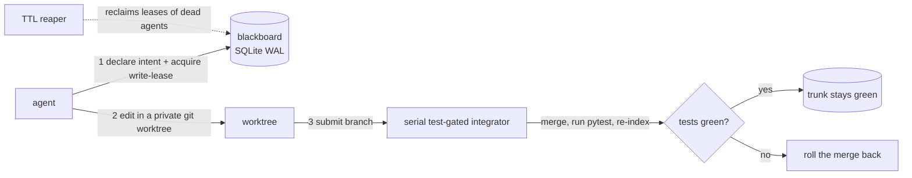

# swarm-sync

**Stigmergy for AI coding swarms.** A shared, live memory that lets many AI coding agents edit the
*same* codebase at once without colliding.

> Multiple AI agents on one repo collide — same files, merge conflicts, broken assumptions, duplicated
> work. swarm-sync analyzes and classifies the codebase into safely-parallel **parcels**, hands each
> agent an exclusive **lease** and its own **git worktree**, and keeps everyone in sync through a shared
> **blackboard** — a live SQLite representation of the current state of the code. Coordination is
> *stigmergic*: agents read and write the environment, never each other.

This is the **Pheromesh** architecture (the name is explained below). Three docs, by what you want:

- **Use it** → this README.
- **Understand or improve it** → [`ARCHITECTURE.md`](ARCHITECTURE.md) — how the pieces work, in plain
  language, and where each lives in the code.
- **The full build spec** → [`DESIGN.md`](DESIGN.md).

---

## The words this README uses

swarm-sync borrows its vocabulary from ant colonies and databases. Read these once and the rest of
the README (and the code) reads easily:

- **Stigmergy** — coordination by leaving marks in a shared environment instead of messaging each
  other. Ants drop pheromone trails and follow trails; they never hold meetings. swarm-sync's agents
  work the same way: they only ever read and write the shared blackboard, never talk directly.
- **Pheromesh** — the name for this whole architecture: *pheromone* + *mesh*. A mesh of agents
  coordinating through one shared, decaying, stigmergic memory. It's the design this repo implements,
  not a library you install.
- **Blackboard** — that shared memory: a single SQLite database every agent reads and writes. It
  holds the parcel map, the leases, the frozen contracts, the pheromone trails, and an append-only
  event log.
- **Parcel** — a leasable unit of code. The classifier parses the repo into one parcel per
  function/method/class, plus one synthetic parcel for each whole file. (Today the lock is always
  taken on the whole-file parcel — see [Granularity](#granularity-swarm-sync-locks-whole-files).)
- **Lease** — a temporary, exclusive claim on a file. Holding it means you're the only agent allowed
  to edit that file right now. It expires unless refreshed, so a crashed agent can't lock a file
  forever.
- **Worktree** — a private git checkout. Each broker-driven agent gets its own, so two agents can't
  even physically write the same file on disk.
- **Contract** — a heavily-depended-on function signature, "frozen" because so much breaks if it
  changes. When one changes, dependents get a `contract_change` notice so they can re-plan.
- **Pheromone trail** — the decaying "I'm planning/working here" signals in the event log, so agents
  can see current activity without messaging each other.
- **Integrator** — the single gatekeeper that merges each agent's branch one at a time, runs the
  tests, and **rolls the merge back if they fail** — so the main branch is never broken.
- **Reaper** — the background janitor that clears the leases of agents that died (stopped
  heartbeating) and lets their work be reassigned.

For how these fit together and where they live in the code, see [`ARCHITECTURE.md`](ARCHITECTURE.md).

---

## Two ways to use it

Pick the one that matches how your agents run — the setup is different:

1. **Claude Code hooks (recommended for real use).** You run Claude Code agents/subagents normally;
   swarm-sync's hooks gate every edit *transparently* in the background. No wiring agents by hand.
   → [Jump to the Claude Code setup](#use-with-claude-code).
2. **The scripted broker/demo.** A Python harness (`coordinator/broker.py`) drives agents directly
   against the blackboard. This is what the demo and test suite use, and how you'd embed swarm-sync
   in your own orchestrator. → Start with **Try it in 2 minutes** below.

Either way, **the unit of the lock is a whole file**: two agents never edit the same file at once —
the second waits. Parallelism comes from working on *different* files. (More in
[Granularity](#granularity-swarm-sync-locks-whole-files).)

---

## Try it in 2 minutes

**Requires Python 3.11+.** Check first — on 3.10 or older, `pip install` backtracks for a long time
instead of telling you the version is the problem:

```bash
python3 --version            # must be 3.11 or newer
```

```bash
git clone https://github.com/keithalindsay/swarm-sync.git
cd swarm-sync

python3 -m venv .venv && source .venv/bin/activate
# (use python3 to create the venv — most distros ship no bare `python`;
#  inside the venv, `python` then exists and is your 3.11+.)
pip install -e ".[dev]"

python demo/run_demo.py      # the whole thing, standalone
```

The demo boots a blackboard, indexes a sample repo, and runs a 3-agent swarm through five scenarios.
You should see:

```
RESULTS
  PASS: test case #1 (three agents on three files land concurrently, clean)
  PASS: test case #2 (contended whole-file parcel serializes)
  PASS: test case #3 (frozen-contract change notifies + dependent re-plans)
  PASS: test case #4 (crash mid-edit is recovered)
  PASS: test case #5 (serial gated integration rejects a bad edit)
  PASS: overall (zero collisions, trunk green throughout)
```

That's the product in one command: three agents editing three different files land cleanly and
concurrently; a fourth hitting a file someone already holds waits its turn; a signature change is
detected and its dependents re-plan; a crashed agent's work is reclaimed; and a test-breaking edit
is rejected before it can reach trunk.

Run the test suite the same way:

```bash
pytest
```

---

## How it works (one paragraph)

A **classifier** parses the repo (Python via the stdlib `ast` module) into *parcels* — one per
function, method, and class, plus a synthetic per-file parcel for the glue — computes each parcel's
**blast radius** (how much breaks if it changes), and freezes high-fan-in **interface contracts**.
A **blackboard** (SQLite in WAL mode) holds the parcel map, leases, contracts, decaying **pheromone**
trails, and an append-only event log. Each agent declares intent, acquires an **atomic write-lease**
on a file, edits inside its **own git worktree**, heartbeats, then submits its branch to a **serial,
test-gated integrator** that merges, runs `pytest`, and re-indexes — rolling the merge back if the
tests go red, so trunk is never poisoned. A **TTL reaper** reclaims the leases of agents that crash.



For the expanded, plain-language version — how each piece works, the life of one edit end to end, and
a map from every concept to the code that implements it — see [`ARCHITECTURE.md`](ARCHITECTURE.md).

---

## Use with Claude Code

Instead of wiring agents in by hand, let Claude Code's own hooks enforce leasing **transparently**:
every `Edit`/`Write` a (sub)agent makes is gated by a real-time lease check, and its lease is
released automatically when the agent stops. When two agents reach for the same file, the second is
denied with a message like:

```
swarm-sync: payments.py is leased by agent-a (~280s left on the current hold; the hold renews while its holder stays active). Pick different work -- run `swarmsync holds` to see who holds what (or GET http://127.0.0.1:8787/leases).
```

> A Claude Code **skill** ships in this repo at [`.claude/skills/swarmsync/`](.claude/skills/swarmsync/SKILL.md):
> it teaches an agent the lease protocol, how to respond to a deny, and the `swarmsync` CLI. Copy it
> into your own `~/.claude/skills/` (or a project's `.claude/skills/`) so agents pick it up automatically.

### Setup

**Quick path:** from your repo, run `swarmsync init-hooks` — it writes the hook block below into
`<repo>/.claude/settings.json` (idempotently; `--dry-run` to preview, `--global` for `~/.claude`) and
drops the `.swarmsync-active` marker to turn coordination on. Then `swarmsync doctor` confirms the
whole setup. The rest of this section is what those two commands do, by hand.

**1 — Wire the hooks.** Add this to `~/.claude/settings.json` (global) or
`<project>/.claude/settings.json` (project-scoped), pointing the `command` paths at your actual
swarm-sync checkout:

```json
{
  "hooks": {
    "PreToolUse": [
      { "matcher": "Edit|Write|MultiEdit|NotebookEdit",
        "hooks": [ { "type": "command", "command": "/path/to/swarm-sync/scripts/swarmsync-hook-guard precheck", "timeout": 10 } ] }
    ],
    "PostToolUse": [
      { "matcher": "Edit|Write|MultiEdit|NotebookEdit",
        "hooks": [ { "type": "command", "command": "/path/to/swarm-sync/scripts/swarmsync-hook-guard postupdate", "timeout": 10 } ] }
    ],
    "SubagentStop": [
      { "hooks": [ { "type": "command", "command": "/path/to/swarm-sync/scripts/swarmsync-hook-guard release", "timeout": 10 } ] }
    ],
    "SessionStart": [
      { "hooks": [ { "type": "command", "command": "/path/to/swarm-sync/scripts/swarmsync-hook-guard session-start", "timeout": 15 } ] }
    ]
  }
}
```

Wire `scripts/swarmsync-hook-guard`, **not** `swarmsync-hook` directly. The guard is a zero-overhead
shim: when swarm-sync isn't active for a repo (step 3) it exits `0` immediately without even starting
Python, so normal, non-coordinated editing pays nothing. It only launches the real adapter when a
session is active.

**2 — Start the blackboard server**, pointed at the repo you're coordinating:

```bash
swarmsync-serve --root /path/to/your/repo --db /tmp/swarmsync.db --port 8787
```

Leave it running for the session — it's the shared blackboard every hook call and agent talks to. It
prints the repo it's managing at startup; **check that line matches the repo you mean to coordinate**
(this is the single most common misconfiguration — see [Troubleshooting](#troubleshooting)).

**3 — Turn coordination on for the repo.** Enforcement is opt-in per repo:

```bash
touch /path/to/your/repo/.swarmsync-active     # on
rm    /path/to/your/repo/.swarmsync-active     # off
```

(Or set `SWARMSYNC_ACTIVE=1` in the environment — handy for CI. When neither is set, the hooks are a
no-op and every edit is allowed, so installing the hooks never interferes with ordinary work.)

**4 — Run your agents.** That's it. Edits to free files proceed silently; edits to a file another
agent holds are denied with the message above until it's released.

### Operating a session — the `swarmsync` CLI

A single read-only command talks to the running blackboard over the same HTTP the hooks use (default
`$SWARMSYNC_URL`), so you — or a denied agent, from its own shell — can see and steer coordination:

```bash
swarmsync status              # is the server up, bound to which repo, how busy?
swarmsync holds               # every active hold: parcel, holder, mode, TTL-remaining
swarmsync free payments.py    # of these paths, which are free? (exit 1 if any held)
swarmsync events --follow     # tail the event stream
swarmsync doctor              # diagnose the setup; each check prints a fix if it fails
```

`swarmsync free foo.py && …` gates work in one line — the deny message an agent hits points it right
back here (`swarmsync holds`). For the raw API, the server also serves interactive Swagger docs at
`GET http://127.0.0.1:8787/docs`.

### Troubleshooting

Two failure modes are quiet by design (the hooks *fail open* so they never block ordinary work), so
they're worth knowing before they bite:

- **The server's managed root must contain your repo.** `swarmsync-serve` restricts `/index` and
  `/integrate` to paths under its root (`--root`, or `SWARMSYNC_ROOTS`, defaulting to the launch
  directory). If it's pointed anywhere that isn't an ancestor of your repo, indexing is refused,
  nothing gets a parcel, and — because the hooks fail open — **every edit is allowed with no
  coordination at all**, silently. The fix is always: pass `--root` explicitly and confirm the
  startup line. One server coordinates **one** repo; for a second repo, run a second server on
  another port.
- **The hook talks to port 8787 by default.** The adapter's default `SWARMSYNC_URL` is
  `http://127.0.0.1:8787`, matching the launcher's default port — so a stock `swarmsync-serve` and a
  stock hook find each other with no configuration. If you serve on a different `--port` (or host),
  export `SWARMSYNC_URL` to match, or the hook can't reach the server and (failing open) allows
  every edit.

There is exactly **one launcher**: `swarmsync-serve` (the `swarm-sync` command is the same program —
both console scripts run the same `main`). Same defaults everywhere: port **8787**, DB
`swarmsync.db` (or `SWARMSYNC_DB`), `--root`/`--fresh`, the managed-root banner, and the startup
clock check. Earlier versions shipped a second launcher on port 8000 with different defaults;
following the wrong one was a silent fail-open, so it's gone.

## Configuration (environment variables)

Everything is optional — unset knobs use the defaults below, and a garbage value falls back to the
default rather than crashing (a typo must never take the blackboard down or silently disable a
lease). All reads go through [`swarmsync/config.py`](swarmsync/config.py), the one module allowed to
touch the environment.

| Variable | Default | Meaning |
|---|---|---|
| `SWARMSYNC_ACTIVE` | unset (off) | Hook opt-in: exactly `1` activates coordination for a session regardless of marker files (the `.swarmsync-active` marker is the per-repo alternative). |
| `SWARMSYNC_URL` | `http://127.0.0.1:8787` | Blackboard base URL the hook adapter talks to. Must match where `swarmsync-serve` is listening. |
| `SWARMSYNC_TOKEN` | unset (no auth) | Bearer token required on every mutating route when set; the hook sends it automatically. |
| `SWARMSYNC_ROOTS` | launch cwd | Managed-root allow-list for `/index`/`/integrate` (403 outside it). Exactly **one** root; `--root` sets it for you. |
| `SWARMSYNC_DB` | `swarmsync.db` | Default SQLite path for the launcher's `--db` (the flag wins). `SWARM_SYNC_DB` is honored as a deprecated alias, with a stderr warning. |
| `SWARMSYNC_LEASE_TTL` | `300` (seconds) | Lease TTL the hook acquires/renews with. Zero/negative/over-ceiling values are refused loudly and the default used — a typo must not disable lease protection. |
| `SWARMSYNC_GATE_TIMEOUT` | `600` (seconds) | Wall-clock ceiling on the integrator's pytest gate; also widens the agent client's `/integrate` HTTP timeout to match. |
| `SWARMSYNC_MAX_LEASES_PER_AGENT` | `256` | Cap on active leases one agent id may hold (bounds `ensure_parcel` abuse). |
| `SWARMSYNC_MAX_BODY_BYTES` | `10485760` (10 MiB) | Request bodies declaring more than this are rejected 413 before buffering. |
| `SWARMSYNC_EVENTS_COMPACT_INTERVAL` | `60` (seconds) | How often the background reaper runs an events-compaction pass. |
| `SWARMSYNC_EVENTS_HEARTBEAT_MAX_AGE` | `3600` (1 hour) | Retention window for heartbeat events — the keepalive traffic that dominates log growth. |
| `SWARMSYNC_EVENTS_MAX_AGE` | `604800` (7 days) | Retention horizon for any event (still-open integrate audit rows survive regardless). |

---

## What swarm-sync guarantees

| Layer | Mechanism | What it gives you |
|---|---|---|
| Physical | git worktree per agent | same-file clobbering is structurally impossible — for **broker-driven** agents. (Hook-driven Claude subagents share one working tree, so there the lease below is the only protection.) |
| Logical | atomic SQLite CAS lease, **one whole file per lock** | one writer per file, on both the broker and hook paths; the loser of a race is denied and waits. Covers `Edit`/`Write`-family tools — a raw `Bash` write (`sed -i`, `cat >`) bypasses it (see [Security](#security-and-trust-model-read-before-exposing-this-to-anything)). |
| Interface | frozen contracts + `contract_change` events | a landed signature change is **detected and announced** to its dependents so they re-plan. Detection is what ships; it does not *prevent* an in-flight dependent from having built against the old signature (DESIGN §5.3). |
| Integration | serial pytest-gated merge | trunk stays green: every branch is merged, tested, and **rolled back if red**. A break is caught before it *survives* on trunk. Semantic conflicts no test covers are the honest hard limit (DESIGN §6). |

### Granularity: swarm-sync locks whole files

**The unit of parallelism is the file.** Every lease the broker and the Claude Code hook take is on
the one synthetic per-file parcel (`<relpath>::<module>`), regardless of how finely the classifier
parsed the file. So two agents never edit the same file at the same time — the second is denied and
must wait or pick different work. Parallelism comes from working on *different files*.

The classifier still indexes parcels at function/class granularity, and that isn't decoration —
blast radius and the frozen-contract surface are built on those symbol parcels. What is *not*
available is symbol granularity as a **lease/scheduling** mode: requesting it raises an error rather
than appearing to work. That's a deliberate park, with the reasoning and a revival plan in
[`SYMBOL_MODE_DESIGN.md`](SYMBOL_MODE_DESIGN.md) — the short version is that per-function locking is
unsafe with today's lease store, only ever workable on the broker path (never the hook path), and
buys narrower concurrency than it sounds since any edit touching an import escalates to the whole
file anyway. File-level locking is safe *by construction*.

---

## Security and trust model (read before exposing this to anything)

swarm-sync is a **local developer tool for a semi-trusted swarm**: your own agents, on your own
machine, editing your own repo. It is not hardened for untrusted input, and must not be exposed to a
network you don't control.

- **The blackboard runs code from the branches it integrates.** The `/integrate` gate's whole job is
  to run the repo's `pytest` suite against a just-merged, agent-authored branch — so any `conftest.py`
  or `test_*.py` on that branch runs as your user, with your environment. This is the point of the
  design (nothing else can prove trunk stays green), but it means *submitting a branch is equivalent
  to running code on the server*. The gate is time-bounded (`SWARMSYNC_GATE_TIMEOUT`, default 600s),
  not sandboxed.
- **Mutating routes are unauthenticated by default.** Set **`SWARMSYNC_TOKEN`** to require a bearer
  token on `/index`, `/intent`, `/lease`, `/heartbeat`, `/release`, `/parcel/update`, and
  `/integrate`. Unset, anyone who can reach the port can merge a branch and run its tests. Read routes
  (`/parcels`, `/leases`, `/events`, `/contract/{symbol}`) are unauthenticated regardless and expose
  your code's structure — symbol names, signatures, file paths.
- **Bind to localhost.** The default host is `127.0.0.1`; keep it there.
- **Bash-mediated edits are not gated.** The hook matcher covers `Edit|Write|MultiEdit|NotebookEdit`;
  an agent that writes through `Bash` (`sed -i`, `cat >`, `patch`, `git checkout`) bypasses the lease
  check. Coordination is a cooperative protocol among well-behaved agents, not a sandbox that
  constrains a determined one.

---

## Status

A working prototype and a local developer tool — not a hosted service. The engineering is
deliberately thorough: **538 tests** (run 3× with zero flakes), `ruff` + `mypy` clean, and five
review-gated hardening phases — correctness, resource bounds, architecture consolidation, and an
operator surface (`swarmsync status`/`holds`/`free`/`doctor`). Every fix carries a test that fails
when the fix is removed, and the architecture pass was adversarially reviewed before it merged.

Scope is intentionally tight: Python target (the classifier is stdlib `ast`; a tree-sitter backend
is a documented extension point), deterministic scripted agents in the demo (a real Claude Agent SDK
worker is a drop-in for the mutator), a serial integrator, and no TUI. The one designed-but-parked
capability — per-symbol locking — is documented with its revival plan in
[`SYMBOL_MODE_DESIGN.md`](SYMBOL_MODE_DESIGN.md).

## License

MIT © 2026 Keith Lindsay
